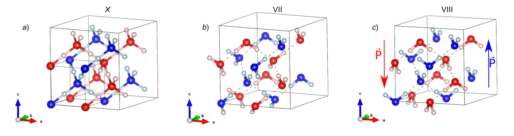
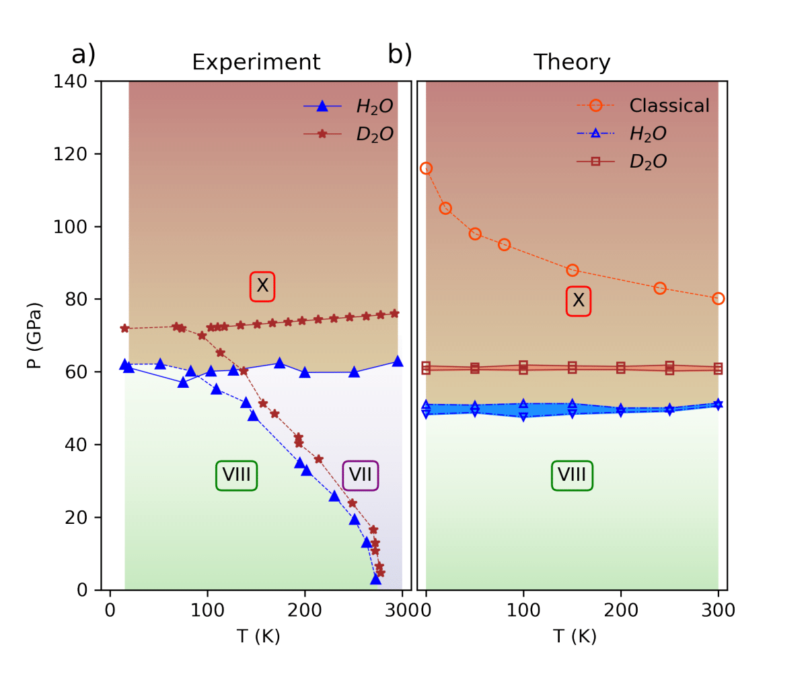
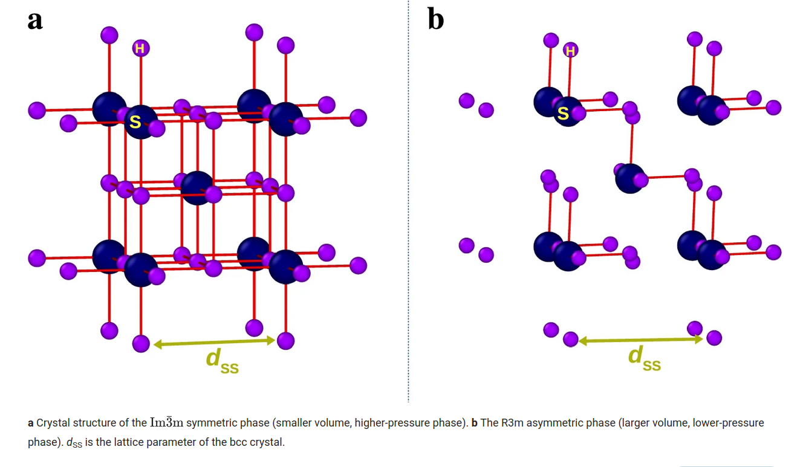
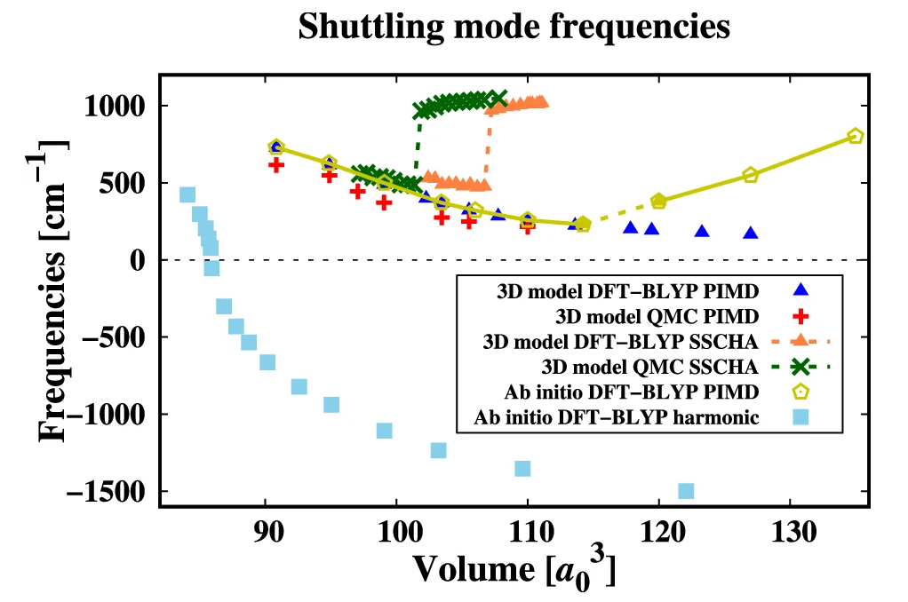

# Computational Physicist

[Click here to download my CV (PDF)](CV_Cherubini.pdf)

[Linkedin](linkedin.com/in/marco-cherubini94)

## Research interests

As a computational condensed matter physicist, my research focuses on understanding how quantum anharmonicity influences the thermodynamic and vibrational properties of materials.  

I contributed to the development of the [SSCHA method](https://iopscience.iop.org/article/10.1088/1361-648X/ac066b) ([SSCHA software](https://sscha.eu/)), to simulate the thermodynamic and phononic properties of materials accounting for anharmonicity at a nonperturbative level, fully including quantum and thermal fluctuations.

### 🧊 Phase Diagram of Ice under High Pressure

I investigated the high-pressure phase diagram of water ice, where phases VII, VIII, and X are stable. Using SSCHA, I demonstrated how quantum effects profoundly alter the classical phase diagram, stabilizing phase X at approximately 50 GPa across all temperatures — in excellent agreement with experimental data ([Phys. Rev. B](https://journals.aps.org/prb/abstract/10.1103/PhysRevB.110.014112)).

### 💧 Anomalous Volume Isotopic Effects in Ambient-Pressure Ice

I applied SSCHA to investigate the anomalous isotopic volume effects in ambient-pressure ice ([J. Chem. Phys.](https://pubs.aip.org/aip/jcp/article-abstract/155/18/184502/199619/The-microscopic-origin-of-the-anomalous-isotopic?redirectedFrom=fulltext)). In this work, I showed how the anomalous volume isotope effects is due to a strong non-linear regime of quantum effects on hydrogen atoms, resulting in a volume expansion followed by contraction, with a maximum located near tritium mass. Additionally, the vibrational IR and Raman spectra computed with SSCHA reproduced experimental results with high accuracy.

### ⚛️ Anharmonic Phonons from Quantum Correlators in PIMD

To overcome the limitations of SSCHA, I recently moved to using Path Integral Molecular Dynamics (PIMD) techniques, enabling an exact treatment of nuclear quantum effects. My group developed a [novel approach](https://pubs.aip.org/aip/jcp/article-abstract/154/22/224108/313340/Probing-anharmonic-phonons-by-quantum-correlators?redirectedFrom=fulltext) for probing anharmonic phonons through quantum displacement-displacement correlators. 

We applied this method to sulfur hydride, one of the most promising candidate for room temperature supeconductivity. We succesfully detected the structural transition between the paraelectric high-pressure phase and the ferroelectric low-pressure phase by looking at the phonon softening computed with our method. 

[Anharmonic phonons repo](https://github.com/marcocherubini/Anharmonic-phonons-post-processing)

Our [results](https://www.nature.com/articles/s41524-024-01239-0)  demonstrate that the experimental peak in the critical superconducting temperature is not directly linked to the structural phase transition 

## 🤖 Machine Learning for Atomistic Simulations

To explore the full phase diagram of sulfur hydride, I combined PIMD simulations with ab initio electronic structure methods. To reduce the computational cost, I developed a machine learning interatomic potential (MLP) trained on ab initio PIMD trajectories.

This MLP enabled extensive PIMD simulations across a wide temperature-pressure range, revealing the microscopic mechanisms responsible for the enhancement of the superconducting critical pressure. While these results are not yet published, they provide deep insights into quantum nuclear effects and phase stability in hydride systems.

## Publications

Link to my [Scholar](https://scholar.google.com/citations?user=1t4hEZIAAAAJ&hl=it)
